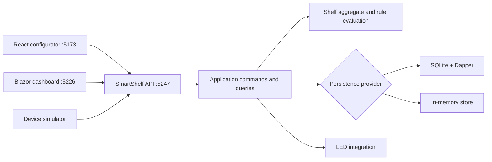

# SmartShelf AI

SmartShelf AI is an edge-first inventory-monitoring system for configurable physical shelves. A shelf aggregates references to products, controllers, cameras, sensors, LED outputs, and evaluation rules. Observations are evaluated locally, persisted with alert transitions, and exposed through an operational dashboard.

The repository contains a .NET 10 API and domain, SQLite and in-memory persistence adapters, a React visual shelf configurator, a Blazor operational dashboard, and an ARM64-oriented device simulator.

## What works today

- Create, edit, enable, disable, configure, and conditionally delete shelves.
- Maintain persisted product, device, and evaluation-rule catalogs.
- Visually connect catalog resources to one shelf at a time.
- Protect shelf changes with optimistic concurrency versions.
- Evaluate custom rules by severity and priority, with a built-in fallback policy.
- Record observations and alert transitions atomically.
- Review current status, observations, and open alerts in the Blazor dashboard.
- Run the same persistence contract with SQLite or an in-memory provider.
- Simulate healthy, warning, critical, and offline readings before hardware is available.
- Publish the simulator for `linux-arm64` and the Orange Pi 5 Plus target.



CQRS is in-process and uses one selected provider. There is no event sourcing or separate eventually consistent read database.

## Repository map

| Path | Purpose |
| --- | --- |
| `src/SmartShelf.Domain` | Shelf aggregate, catalog entities, typed bindings, invariants, and rule evaluation. |
| `src/SmartShelf.Application` | Commands, queries, handlers, contracts, and persistence/hardware ports. |
| `src/SmartShelf.Infrastructure` | Hardware and external integrations, currently including the virtual LED controller. |
| `src/SmartShelf.Infrastructure.Sqlite` | Dapper/SQLite adapter, migrations, transactions, and projections. |
| `src/SmartShelf.Infrastructure.InMemory` | Thread-safe in-memory implementation of the same persistence contract. |
| `src/SmartShelf.Api` | HTTP API, provider selection, error mapping, Swagger, and development seeding. |
| `src/SmartShelf.Configuration.Ui` | React, Vite, Zustand, and XYFlow shelf configurator. |
| `src/SmartShelf.Dashboard` | Blazor operational dashboard and shelf-management screens. |
| `src/SmartShelf.Device.Simulator` | Deterministic shelf-reading and ARM64 decision-loop simulator. |
| `src/SmartShelf.Device` | Placeholder host for the future physical hardware worker/adapters. |
| `tests/SmartShelf.UnitTests` | Domain invariant and rule-evaluation tests. |
| `tests/SmartShelf.IntegrationTests` | Provider, migration, transaction, concurrency, and API tests. |

See [docs/Architecture.md](docs/Architecture.md) for the domain and CQRS boundaries.

## Prerequisites

Required for local development:

- .NET 10 SDK.
- Node.js `20.19+` or `22.12+` and npm, as required by the locked Vite toolchain.
- PowerShell commands below assume the repository root as the current directory.

Optional:

- Docker Desktop or Podman for the container workflow.
- An ARM64 Linux runtime or container builder for edge-target validation.

Verify the local tools:

```powershell
dotnet --version
node --version
npm --version
docker version
```

## Quick start: local development

### 1. Restore the repository

```powershell
dotnet restore .\SmartShelfAI.slnx
npm ci --prefix .\src\SmartShelf.Configuration.Ui
```

`npm ci` uses the committed lockfile and is preferred for a fresh clone. Use `npm install` only when intentionally updating dependencies.

### 2. Start the API

SQLite is the default provider:

```powershell
dotnet run --project .\src\SmartShelf.Api\SmartShelf.Api.csproj --launch-profile http
```

The local API is available at:

- API root: `http://localhost:5247/`
- Health: `http://localhost:5247/health`
- Swagger UI: `http://localhost:5247/swagger/index.html`
- OpenAPI document in Development: `http://localhost:5247/openapi/v1.json`

The first SQLite operation applies embedded migrations. In Development, the API also seeds example products, hardware, and evaluation rules for the configurator.

To use transient in-memory persistence instead, set the provider before starting the API:

```powershell
$env:Persistence__Provider = "inmemory"
dotnet run --project .\src\SmartShelf.Api\SmartShelf.Api.csproj --launch-profile http
```

Remove the override when returning to the configured default:

```powershell
Remove-Item Env:Persistence__Provider -ErrorAction SilentlyContinue
```

### 3. Start the visual configurator

Open a second terminal:

```powershell
npm run dev --prefix .\src\SmartShelf.Configuration.Ui
```

Open `http://localhost:5173`. The configurator targets `http://localhost:5247/api/v1` by default.

To target another API, define the complete `/api/v1` base URL before starting Vite:

```powershell
$env:VITE_API_BASE_URL = "http://localhost:5099/api/v1"
npm run dev --prefix .\src\SmartShelf.Configuration.Ui
```

Only `localhost` and `127.0.0.1` browser origins are currently accepted by the API CORS policy.

### 4. Start the operational dashboard

Open a third terminal:

```powershell
dotnet run --project .\src\SmartShelf.Dashboard\SmartShelf.Dashboard.csproj --launch-profile http
```

Open `http://localhost:5226`. Its local configuration points to the API at `http://127.0.0.1:5247/`.

The operational view is available at `/` (also `/demo`), while shelf administration is at `/shelves/manage`.

Override the API address when necessary:

```powershell
$env:SmartShelfApi__BaseUrl = "http://localhost:5099/"
dotnet run --project .\src\SmartShelf.Dashboard\SmartShelf.Dashboard.csproj --launch-profile http
```

### Local URL summary

| Component | Local project launch | Compose launch |
| --- | --- | --- |
| API | `http://localhost:5247` | `http://localhost:5099` |
| Swagger | `http://localhost:5247/swagger/index.html` | `http://localhost:5099/swagger/index.html` |
| Configurator | `http://localhost:5173` | Not containerized; point it to port `5099`. |
| Dashboard | `http://localhost:5226` | `http://localhost:5100` |

## First end-to-end shelf workflow

1. Start the API and configurator.
2. Select **New** in the configurator. The current quick-create action uses a demo warehouse/aisle/shelf location.
3. Open **Catalog** to review the seeded resources or quick-add a product, sensor, or evaluation rule.
4. Return to **Shelf map**.
5. Drag from the handle on the Shelf node to one or more resource nodes.
6. Double-click a connection to remove it.
7. Select **Save**. The header shows the saved aggregate version.
8. If another client has changed the shelf, an HTTP 409 conflict is shown. Select **Reload**, review the latest graph, and apply the change again.
9. Open the dashboard to edit shelf metadata, enable/disable shelves, inspect observations, and acknowledge alerts.

Binding rules enforced by the domain:

- At most one controller, camera, and LED output per shelf.
- Multiple sensors, products, and evaluation rules are allowed.
- Duplicate `(kind, resourceId)` bindings are rejected.
- Every referenced resource must exist in its catalog.

Evaluation behavior:

- Connected rules are evaluated together.
- The highest-severity match wins; priority breaks ties at the same severity.
- If no custom rules are connected, the built-in shelf health evaluator is used.
- Observation and alert-state persistence completes before the physical LED side effect runs.

Shelf deletion is intentionally restricted. A shelf can be permanently deleted only before it has operational history. After observations exist, disable the shelf instead.

### Minimal API-only workflow

The same flow can be exercised from PowerShell without either UI:

```powershell
$api = "http://localhost:5247/api/v1"

$shelf = Invoke-RestMethod -Method Post -Uri "$api/shelves" -ContentType "application/json" -Body (@{
    name = "Demo shelf"
    location = @{
        warehouse = "Main"
        aisle = "A-01"
        shelf = "S-01"
        position = "P-01"
    }
} | ConvertTo-Json)

Invoke-RestMethod -Method Post -Uri "$api/shelves/$($shelf.id)/observations" -ContentType "application/json" -Body (@{
    inventoryPercent = 72
    daysUntilExpiration = 14
    expiredProductDetected = $false
    sensorOnline = $true
    capturedAt = [DateTimeOffset]::UtcNow
} | ConvertTo-Json)

Invoke-RestMethod -Uri "$api/shelf-overviews/$($shelf.id)"
```

Use `GET /api/v1/shelf-resource-schema` to discover catalog resource IDs and `PUT /api/v1/shelves/{id}/configuration` to replace the binding graph. The configuration body contains the shelf's current `expectedVersion` and a `bindings` array of `{ kind, resourceId }` objects.

## Device simulator

The simulator supports console-only demonstrations and connected API observations.

### Offline/console demonstration

This does not require the API or an existing shelf:

```powershell
dotnet run --project .\src\SmartShelf.Device.Simulator\SmartShelf.Device.Simulator.csproj -- --scenario demo --cycles 12 --offline
```

The output includes the process architecture, reading, local status, LED color, reason, and confidence.

### Send observations to the API

First create a shelf in the configurator or dashboard and copy its GUID from `GET /api/v1/shelves` in Swagger. The shelf must exist and be enabled.

```powershell
$shelfId = "PUT-SHELF-GUID-HERE"
dotnet run --project .\src\SmartShelf.Device.Simulator\SmartShelf.Device.Simulator.csproj -- --scenario demo --cycles 12 --delay-ms 750 --shelf-id $shelfId --api-url http://localhost:5247
```

Simulator options:

| Option | Default | Meaning |
| --- | --- | --- |
| `--scenario` | `demo` | `demo`, `normal`, `warning`, `critical`, or `offline`. |
| `--cycles` | `12` | Number of readings to emit. |
| `--delay-ms` | `750` | Delay between readings. |
| `--shelf-id` | Fixed demo GUID | Target API shelf; normally override with a real configured shelf ID. |
| `--api-url` | `http://127.0.0.1:5247` | API origin without `/api/v1`. |
| `--offline` | Off | Disable HTTP transport and print events only. |

The `offline` scenario simulates an unavailable sensor. The `--offline` flag disables network transport; they are separate concepts.
`SMARTSHELF_API_URL` can be used instead of `--api-url`; the command-line value takes precedence.

## Persistence configuration

Provider selection is validated during startup. Supported values are `sqlite`, `inmemory`, and the `memory` alias. Unknown values fail immediately.

| Provider | Behavior | Recommended use |
| --- | --- | --- |
| `sqlite` | Durable catalogs, shelves, bindings, observations, and alerts. Uses Dapper, one connection per operation, WAL, foreign keys, a five-second busy timeout, migrations, indexes, and transactions. | Default local and deployed environment. |
| `inmemory` | Thread-safe process-local snapshots implementing the same contracts. All state disappears when the API stops. | Tests, demos, and fast development. |

Default API configuration:

```json
{
  "ConnectionStrings": {
    "SmartShelf": "Data Source=data/smartshelf.db;Cache=Shared"
  },
  "Persistence": {
    "Provider": "sqlite"
  }
}
```

Override configuration with standard .NET environment-variable names:

```powershell
$env:Persistence__Provider = "sqlite"
$env:ConnectionStrings__SmartShelf = "Data Source=C:\temp\smartshelf.db;Cache=Shared"
```

The default local database is created under `src/SmartShelf.Api/data`. Compose stores it in the `smartshelf-data` named volume at `/app/data/smartshelf.db`.

SQLite migrations are embedded, numbered SQL resources. Existing legacy shelf device/camera strings are migrated into typed catalog devices and bindings without removing observation or alert history.

## HTTP API guide

Swagger is the easiest way to explore request and response bodies. The main route groups are:

| Routes | Purpose |
| --- | --- |
| `GET/POST /api/v1/shelves` | List and create shelves. |
| `GET/PUT/DELETE /api/v1/shelves/{id}` | Read, versioned edit, and restricted deletion. |
| `PATCH /api/v1/shelves/{id}/enabled` | Versioned enable/disable operation. |
| `GET/PUT /api/v1/shelves/{id}/configuration` | Read or replace the versioned resource-binding graph. |
| `POST/GET /api/v1/shelves/{id}/observations` | Record or list observation history. |
| `GET /api/v1/shelves/{id}/observations/latest` | Latest observation and decision. |
| `GET /api/v1/shelf-resource-schema` | Categorized nodes available to the configurator. |
| `GET /api/v1/shelf-overviews[/{id}]` | Composed configuration, status, latest observation, and alert read models. |
| `/api/v1/products` | Product catalog CRUD. |
| `/api/v1/devices` | Controller, camera, sensor, and LED-output catalog CRUD. |
| `/api/v1/evaluation-rules` | Rule catalog CRUD. |
| `GET /api/v1/shelf-status` | Operational shelf summaries. |
| `GET /api/v1/alerts` | Filtered alert list. |
| `POST /api/v1/alerts/{id}/acknowledge` | Acknowledge an alert. |

Shelf mutations require the last observed `expectedVersion`. Error mapping is consistent:

- `400` for validation and binding errors.
- `404` for missing shelves/resources.
- `409` for stale versions, invalid state transitions, bound-resource deletion, or deletion after operational history.
- `500` for unexpected failures.

## Containers with Docker or Podman

The default Compose stack starts the API and dashboard. The React configurator remains a local Vite application.

Docker:

```powershell
docker compose up --build -d
docker compose ps
```

Podman:

```powershell
podman compose up --build -d
podman compose ps
```

Open:

- Dashboard: `http://localhost:5100`
- API: `http://localhost:5099`
- Swagger: `http://localhost:5099/swagger/index.html`

Start the configurator against the containerized API:

```powershell
$env:VITE_API_BASE_URL = "http://localhost:5099/api/v1"
npm run dev --prefix .\src\SmartShelf.Configuration.Ui
```

To send containerized simulator readings, first create a shelf through the API/configurator, then run the simulator profile with that shelf ID:

```powershell
$shelfId = "PUT-SHELF-GUID-HERE"
docker compose --profile simulator run --rm smartshelf.simulator --scenario demo --cycles 12 --shelf-id $shelfId --api-url http://smartshelf.api:8080
```

Use `podman compose` in place of `docker compose` when appropriate.

Stop services while preserving the SQLite volume:

```powershell
docker compose down
```

Delete the named volume only when intentionally discarding all persisted data:

```powershell
docker compose down --volumes
```

## ARM64 and Orange Pi deployment

Publish a framework-dependent ARM64 simulator:

```powershell
dotnet publish .\src\SmartShelf.Device.Simulator\SmartShelf.Device.Simulator.csproj -c Release -r linux-arm64 --self-contained false
```

Output is written below:

```text
src/SmartShelf.Device.Simulator/bin/Release/net10.0/linux-arm64/publish/
```

A framework-dependent publish requires the matching .NET runtime on the target. Use `--self-contained true` when deployment must include the runtime.

Build only the simulator image for ARM64:

```powershell
docker buildx build --platform linux/arm64 -f .\src\SmartShelf.Device.Simulator\Dockerfile -t smartshelf-device-simulator:arm64 .
```

Build the Compose services for ARM64:

```powershell
$env:SMARTSHELF_PLATFORM = "linux/arm64"
docker compose --profile simulator build
```

On an ARM64 board this platform is native. An x64 workstation requires container-engine emulation and builds more slowly.

The current `SmartShelf.Device` worker is a hardware-host placeholder. Real GPIO, sensor, camera, or MQTT adapters should preserve the observation contract already exercised by `SmartShelf.Device.Simulator`.

See [docs/Deployment/ARM64.md](docs/Deployment/ARM64.md), [docs/Hardware/Emulator.md](docs/Hardware/Emulator.md), and [docs/Hardware/OrangePi5Plus.md](docs/Hardware/OrangePi5Plus.md).

## Development workflow

When adding a business capability:

1. Put aggregate invariants and evaluation behavior in `SmartShelf.Domain`.
2. Add a focused command/query and handler in `SmartShelf.Application`.
3. Express persistence needs through use-case-specific application ports.
4. Implement the complete contract in both SQLite and in-memory adapters.
5. Expose the use case through the API or a UI read model.
6. Add domain tests plus provider-contract or API integration coverage.

Keep database packages and SQL out of `SmartShelf.Infrastructure`; they belong in `SmartShelf.Infrastructure.Sqlite`. Avoid returning mutable aggregate instances from the in-memory provider. Do not bypass `expectedVersion` on shelf mutations.

## Build and test

Full .NET acceptance:

```powershell
dotnet restore .\SmartShelfAI.slnx
dotnet build .\SmartShelfAI.slnx --no-restore
dotnet test .\SmartShelfAI.slnx --no-build
```

Configurator acceptance:

```powershell
npm ci --prefix .\src\SmartShelf.Configuration.Ui
npm test --prefix .\src\SmartShelf.Configuration.Ui -- --run
npm run build --prefix .\src\SmartShelf.Configuration.Ui
```

The integration suite runs the shared persistence contract against SQLite and in-memory implementations, verifies migrations and concurrency, and exercises the configuration API with both providers.

## Troubleshooting

### Dashboard shows no data

Check `SmartShelfApi__BaseUrl`. Use `http://localhost:5247/` for local project launch and `http://localhost:5099/` when the API is exposed by Compose.

### Configurator cannot reach the API

Confirm `/health` responds, `VITE_API_BASE_URL` includes `/api/v1`, and the browser origin is `localhost` or `127.0.0.1`.

### Simulator prints 404 or 409

Use the GUID of an existing, enabled shelf. The simulator's built-in demo GUID is not automatically created. A disabled shelf rejects observations.

### Save returns HTTP 409

The shelf version is stale. Reload the shelf configuration, reapply the intended connections, and save using the new version.

### Shelf deletion returns HTTP 409

The shelf has operational history or its version is stale. Shelves with history must be disabled instead of deleted.

### Unknown persistence provider stops startup

Use `sqlite`, `inmemory`, or `memory`. Check `Persistence__Provider` for a leftover environment override.

### SQLite file location is unexpected

Use an absolute `ConnectionStrings__SmartShelf` value. Relative SQLite paths are resolved by the running application environment.

### HTTPS certificate errors

The documented local workflow uses HTTP launch profiles. If HTTPS is required, trust the development certificate with `dotnet dev-certs https --trust`.

## Current limitations and security

- Authentication and authorization are not implemented. Do not expose this API directly to an untrusted network.
- The physical `SmartShelf.Device` worker is still a placeholder; the simulator is the functional edge-development target.
- The configurator provides quick catalog creation; full update/delete operations are currently available through Swagger/API.
- SQLite and in-memory projections are synchronous/on-demand. There is no distributed message broker or separate read database.
- The virtual LED controller represents the current physical-output adapter.
- ERP, MQTT, camera inference, and RK3588 NPU execution are planned integrations, not completed production features.

## Additional documentation

- [Architecture and CQRS boundaries](docs/Architecture.md)
- [Device emulator](docs/Hardware/Emulator.md)
- [ARM64 deployment](docs/Deployment/ARM64.md)
- [Orange Pi 5 Plus target](docs/Hardware/OrangePi5Plus.md)
- [License](LICENSE.md)
